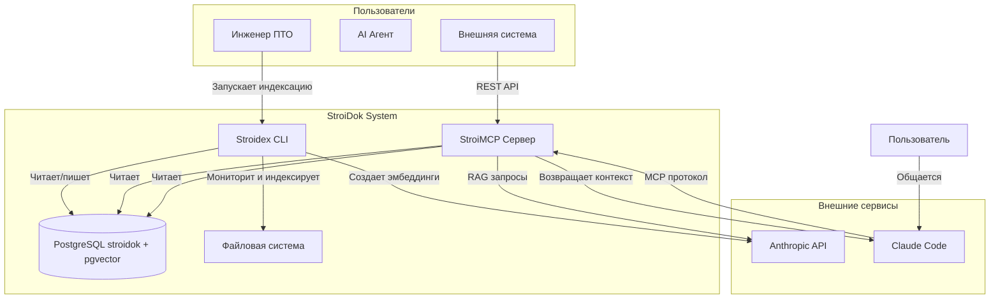

# StroiDok - Интеллектуальная система анализа документов

## Обзор

**StroiDok** - это система интеллектуального анализа строительной документации на базе LLM, которая позволяет **чатиться с документами через Claude Code**.

### 💬 Ключевая возможность
**Пользователь общается с технической документацией на естественном языке**, а Claude Code автоматически находит релевантную информацию в документах и использует ее для ответов.

### 🏗️ Архитектура

- **Stroidex** - CLI приложение для мониторинга и индексации документов (смотри
  docs/stroidex/README.md)
- **StroiMCP** - MCP-сервер для поиска и взаимодействия с документами (смотри
  docs/StroiMCP/README.md)

### 🔄 Поток взаимодействия
```
Пользователь ↔ Claude Code ↔ StroiMCP ↔ Ваши документы
```

Система обеспечивает бесшовный интерфейс для работы с документальной базой знаний через привычный чат с AI-ассистентом.

## 📚 Детальная документация

### Системная документация
- [Архитектура системы](docs/architecture/overview.md) - C4 модель и контекст системы
- [Системные спецификации](docs/specs/) - сквозная функциональность и взаимодействие:
  - [Индексация и хранение](docs/specs/indexing-storage-implementation-plan.md) - архитектура данных и стратегии индексации
  - [Оркестрация процессов](docs/specs/process-orchestration-implementation-plan.md) - управление жизненным циклом и масштабирование
- [Глоссарий](docs/glossary.md) - унифицированная терминология
- [Матрица ответственности](docs/component-responsibility-matrix.md) - разделение функций между компонентами
- [Интеграция с Claude Code](docs/mcp-claude-code-integration.md) - MCP протокол и инструменты
- [Sequence диаграммы](docs/architecture/sequence-diagrams.md) - сценарии взаимодействия компонентов
- [Схема базы данных](docs/database-schema.md) - полная схема PostgreSQL + pgvector

### Спецификации компонентов
- [Stroidex CLI](docs/stroidex/specs/) - спецификации CLI приложения
- [StroiMCP Server](docs/StroiMCP/specs/) - спецификации MCP сервера

## Компоненты системы

### Stroidex (CLI приложение)
**Основные функции:**
- Поддержка форматов документов: PDF, DOC, DOCX, XLSX, TXT
- Отслеживание изменений файловой системы в реальном времени
- Автоматическое извлечение текстового содержимого
- Индексация и хранение обработанных данных в PostgreSQL
- Создание эмбеддингов для семантического поиска
- Подготовка данных для поиска и анализа

**Stroidex НЕ делает:**
- Поиск документов
- Ответы на вопросы
- RAG функциональность
- Text-to-SQL запросы

### StroiMCP (MCP-сервер)
**Основные функции:**
- Поиск документов (семантический и полнотекстовый)
- RAG (Retrieval-Augmented Generation)
- Text-to-SQL функциональность
- Интеграция с Claude Code через MCP-протокол
- Предоставление инструментов для AI-ассистентов

## 🏗️ Архитектура

### Упрощенная схема потока данных

```
Файловая система → Stroidex → Anthropic API → PostgreSQL → StroiMCP → Claude Code → Пользователь
```

### Детальная архитектура (C4 Level 1 Context)



**Подробная архитектура:** см. [docs/architecture/overview.md](docs/architecture/overview.md)

## Установка

### Предварительные требования
- Go 1.21 или выше
- PostgreSQL с pgvector и pg_trgm
- Поддерживаемые платформы: macOS, Windows 10/11, Linux

### 🔧 Технологический стек

#### Основные технологии
- **Go** - основной язык разработки (кроссплатформенность, высокая производительность)
- **PostgreSQL + pgvector** - единая база данных для реляционных данных и векторного поиска
- **pg_trgm** - триграммный поиск для нечеткого matching и поиска по схожести
- **Anthropic API** - единый LLM провайдер для эмбеддингов и RAG
- **MCP Protocol** - стандарт интеграции с Claude Code (Model Context Protocol)

#### Обработка и производительность
- **Goroutine pools** - для параллельной обработки документов
- **Worker queue pattern** - для очередей задач индексации
- **Context-based cancellation** - для управления жизненным циклом процессов
- **Streaming processing** - для эффективной обработки больших файлов
- **Memory pooling** - для уменьшения аллокаций и оптимизации памяти

#### Кэширование
- **L1 (In-memory)** - быстрое кэширование в рамках одного процесса
- **L2 (Redis)** - распределенное кэширование между процессами
- **L3 (PostgreSQL)** - персистентное хранилище с оптимизированными индексами

### Сборка из исходников
```bash
# Клонирование репозитория
git clone https://github.com/your-org/stroidok.git
cd stroidok

# Сборка CLI приложения (Stroidex)
go build -o stroidex main.go

# Или через Makefile
make build
```

### Установка бинарных файлов
```bash
# Перемещение в PATH
sudo mv stroidex /usr/local/bin/

# Или добавление в текущую директорию
export PATH=$PATH:$(pwd)
```

## Использование

### 💬 Диалог с документами через Claude Code

**Основной способ использования** - общение с документами на естественном языке:

```bash
# Запуск Claude Code с интеграцией StroiDok
claude code --context-from-stdin "Какие требования к пожарной безопасности в нашем проекте?"

# Примеры вопросов:
# "Найди все документы о фундаменте"
# "Какие материалы используются в отделке?"
# "Сравни спецификации для двух зданий"
# "Покажи нормы безопасности для высотных работ"
```

### Stroidex (для администрирования)

Stroidex - это foreground приложение для непрерывной индексации и мониторинга документов.

#### Основная команда
```bash
# Основной режим - непрерывный мониторинг и индексация
stroidex ./documents

# Мониторинг текущей директории
stroidex .

# Однократная индексация и выход
stroidex ./documents --once

# Детальный вывод с кастомными настройками
stroidex ./documents --verbose --watch-interval 10s --workers 8

# Проверка конфигурации (что будет обработано)
stroidex ./documents --dry-run

# Использование кастомного конфига
stroidex ./documents --config ./prod.yaml
```

#### Помощь и версия
```bash
# Показать справку
stroidex --help

# Показать версию
stroidex --version
```

#### Опции команды
- `--config string` - путь к файлу конфигурации (default: "config.yaml")
- `--once` - выполнить однократную индексацию и выйти
- `--watch-interval duration` - интервал проверки изменений (default: 30s)
- `--patterns strings` - паттерны файлов для обработки (default: "*.pdf,*.docx,*.xlsx,*.txt")
- `--workers int` - количество воркеров (default: 4)
- `--batch-size int` - размер пакета обработки (default: 10)
- `--verbose` - детальный вывод логов
- `--dry-run` - показать что будет обработано без реальных действий

---

## 🛠️ Администрирование системы

### StroiMCP сервер (для Claude Code)

#### Запуск MCP-сервера
```bash
# Запуск с настройками по умолчанию
stroimcp

# Запуск с конфигурацией
stroimcp --config config.yaml

# Указание порта
stroimcp --port 8080
```

StroiMCP предоставляет MCP инструменты для Claude Code и работает в фоновом режиме.

## Конфигурация

### Файл конфигурации Stroidex
```yaml
# config/stroidex.yaml
database:
  host: localhost
  port: 5432
  name: stroidok
  user: stroidex
  password: ${DB_PASSWORD}

llm:
  provider: anthropic
  api_key: ${ANTHROPIC_API_KEY}
  model: claude-3-5-sonnet
  embedding_model: claude-3-5-sonnet

# Общие настройки обработки документов
processing:
  directories:
    - /path/to/documents
    - /path/to/specs
  file_patterns:
    - "*.pdf"
    - "*.docx"
    - "*.xlsx"
    - "*.txt"
  watch_interval: 30s
  max_file_size: 100MB
  batch_size: 10
  workers: 4

# Настройки foreground режима
runtime:
  verbose: false
  dry_run: false
  once: false
```

### Файл конфигурации StroiMCP
```yaml
# config/stroimcp.yaml
server:
  host: 0.0.0.0
  port: 8080
  read_timeout: 30s
  write_timeout: 30s

database:
  host: localhost
  port: 5432
  name: stroidok
  user: stroimcp
  password: ${DB_PASSWORD}

llm:
  provider: anthropic
  api_key: ${ANTHROPIC_API_KEY}
  model: claude-3-5-sonnet

mcp:
  server_address: localhost:8080
  timeout: 30s

cache:
  redis:
    host: localhost
    port: 6379
    db: 0
    ttl: 5m
```

## Архитектура

### Структура проекта
```
stroidok/
├── main.go                    # Основная точка входа
├── go.mod                     # Go модуль
├── go.sum                     # Зависимости
├── Makefile                   # Сборочные скрипты
├── .go-version               # Версия Go для проекта
├── .gitignore                 # Игнорируемые файлы
├── internal/
│   ├── cli/                   # CLI интерфейс (Stroidex)
│   │   ├── root.go           # Основная команда и опции
│   │   ├── progress.go       # Прогресс-бары и статус
│   │   └── signals.go        # Обработка сигналов (SIGINT/SIGTERM)
│   ├── core/                  # Основная бизнес-логика
│   │   ├── engine.go         # Ядро обработки
│   │   └── config.go         # Управление конфигурацией
│   ├── parser/                # Парсеры документов
│   │   ├── pdf.go            # PDF парсер
│   │   ├── docx.go           # DOCX парсер
│   │   ├── xlsx.go           # XLSX парсер
│   │   └── txt.go            # TXT парсер
│   ├── indexer/               # Индексация и хранение
│   │   ├── storage.go        # Работа с БД
│   │   └── search.go         # Поисковые индексы
│   ├── monitor/               # Мониторинг ФС
│   │   └── watcher.go        # Отслеживание изменений
│   └── mcp/                   # MCP сервер (StroiMCP)
│       ├── server.go         # MCP сервер
│       ├── handlers.go       # Обработчики запросов
│       └── tools.go          # MCP инструменты
├── pkg/                       # Общие пакеты
│   ├── database/             # Работа с БД
│   ├── logger/               # Логирование
│   └── utils/                # Утилиты
├── config/                    # Конфигурации
│   ├── stroidex.yaml         # Конфиг Stroidex
│   └── stroimcp.yaml         # Конфиг StroiMCP
├── docs/                      # Документация
│   ├── architecture/         # Архитектурные документы
│   ├── specs/                # Спецификации
│   ├── stroidex/             # Документация CLI
│   ├── StroiMCP/             # Документация MCP
│   ├── database-schema.md    # Схема БД
│   └── glossary.md           # Глоссарий
├── example/                   # Примеры документов
└── build/                     # Собранные бинарные файлы
```

## 🤖 Интеграция с Claude Code

StroiMCP обеспечивает глубокую интеграцию с Claude Code через MCP-протокол, предоставляя интеллектуальные инструменты для работы с документами.

### MCP инструменты для Claude Code

- **`search_documents`** - семантический поиск по документам с использованием векторных представлений
- **`get_document_content`** - получение полного содержимого документа или его фрагментов
- **`list_recent_changes`** - отслеживание последних изменений в документальной базе
- **`text_to_sql`** - выполнение запросов к базе данных на естественном языке

### Преимущества интеграции

- **Автоматическое определение релевантности** - Claude Code автоматически определяет, когда нужно использовать StroiDok
- **Контекстуальное обогащение** - найденные документы автоматически добавляются в контекст текущего запроса
- **Бесшовная работа** - не нужно переключаться между инструментами

### Sequence диаграммы

Детальные сценарии взаимодействия доступны в [docs/architecture/sequence-diagrams.md](docs/architecture/sequence-diagrams.md):
- Сценарии индексации документов
- Процессы семантического поиска
- MCP взаимодействия с Claude Code
- Обработка ошибок и восстановление

## Разработка

### Сборка
```bash
# Сборка всех компонентов
make build

# Кросс-компиляция
make build-all

# Очистка
make clean
```

### Тестирование
```bash
# Запуск всех тестов
make test

# Запуск с покрытием
make test-coverage

# Интеграционные тесты
make test-integration
```

## Лицензия

[Укажите вашу лицензию]

---

Больше информации и отчеты об ошибках:
https://github.com/your-org/stroidok
