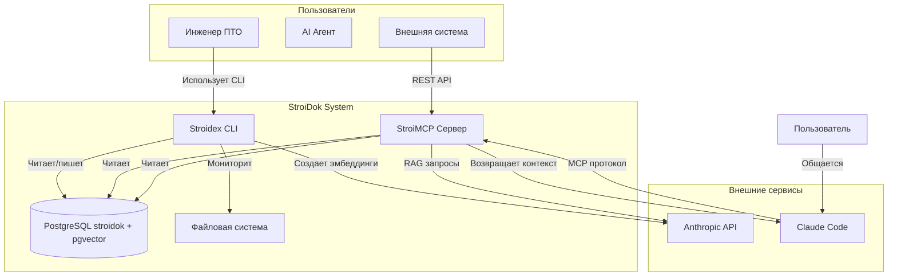

# Общая архитектура проекта StroiDok (Level 1 по C4 Model)

## Контекст системы

**StroiDok** - это интеллектуальная система анализа документов на базе LLM, которая обеспечивает естественный интерфейс для взаимодействия с документальной базой знаний через CLI приложение и MCP-сервер.

> **Терминология:** Все используемые термины определены в [`глоссарии`](../glossary.md)

## Архитектурная схема

```
┌─────────────────┐    ┌─────────────────┐    ┌─────────────────┐    ┌─────────────────┐
│   File System   │    │   Stroidex      │    │   StroiMCP     │    │   Claude Code   │
│                 │    │   (Indexer)     │    │  (MCP Server)   │    │   (User Interface)│
│  ┌───────────┐  │    │                 │    │                 │    │                 │
│  │ documents │  │    │ ┌─────────────┐ │    │ ┌─────────────┐ │    │ ┌─────────────┐ │
│  │           │  │◄──►│ │ FileWatcher │ │    │ │   MCP       │ │◄──►│ │  MCP Client │ │
│  └───────────┘  │    │ └─────────────┘ │    │ │   Server    │ │    │ └─────────────┘ │
│                 │    │                 │    │ └─────────────┘ │    │                 │
│                 │    │ ┌─────────────┐ │    │                 │    │ ┌─────────────┐ │
│                 │    │ │   Parser    │ │    │ ┌─────────────┐ │    │ │   User      │ │
│                 │    │ └─────────────┘ │    │ │  Search     │ │    │ └─────────────┘ │
│                 │    │                 │    │ │   Engine    │ │    │                 │
│                 │    │ ┌─────────────┐ │    │ └─────────────┘ │    │                 │
│                 │    │ │  Indexer    │ │    │                 │    │                 │
│                 │    │ └─────────────┘ │    │ ┌─────────────┐ │    │                 │
│                 │    │ ┌─────────────┐ │    │ │Text-to-SQL  │ │    │                 │
│                 │    │ │ Embeddings  │ │    │ │   Engine    │ │    │                 │
│                 │    │ └─────────────┘ │    │ └─────────────┘ │    │                 │
│                 │    │                 │    │                 │    │                 │
│                 │    │┌──────────────┐│    │┌──────────────┐│    │                 │
│                 │    ││Anthropic API││    ││Anthropic API││    │                 │
│                 │    ││ (Embeddings) ││    ││ (RAG/Analysis)││    │                 │
│                 │    │└──────────────┘│    │└──────────────┘│    │                 │
│                 │    │ └─────────────┘ │    │ └─────────────┘ │    │                 │
└─────────────────┘    └─────────────────┘    └─────────────────┘    └─────────────────┘
         │                       │                       │                       │
         └───────────────────────┼───────────────────────┼───────────────────────┘
                                 │                       │
                    ┌─────────────────┐
                    │   Shared DB     │
                    │                 │
                    │ ┌─────────────┐ │
                    │ │ PostgreSQL  │ │
                    │ │ + pgvector  │ │
                    │ └─────────────┘ │
                    └─────────────────┘
```

### Пользователи системы
- **Инженеры ПТО** - используют CLI интерфейс для анализа строительной документации, технических спецификаций, проектной документации
- **AI агенты** - взаимодействуют с системой через MCP-протокол
- **Системы интеграции** - используют REST API для автоматизации процессов

## C4 Level 1 - Контекст системы



## Внешние зависимости

### LLM провайдеры
- **Anthropic API** - единый LLM провайдер для обработки естественного языка, генерации ответов и создания эмбеддингов

### Системы хранения
- **Файловая система** - хранение исходных документов
- **База данных** - индексированное содержимое документов и метаданные

### Внешние интеграции
- **Claude Code** - через MCP-протокол для обогащения контекста
- **Сторонние приложения** - через REST API

## Основные компоненты

### 1. Stroidex (CLI приложение)
Кроссплатформенное консольное приложение на Go для:
- Мониторинга файловой системы
- Индексации документов различных форматов
- Создания эмбеддингов для семантического поиска
- Подготовки данных для поиска

**Stroidex НЕ делает:**
- Поиск документов
- Ответы на вопросы пользователей
- RAG функциональность
- Text-to-SQL запросы

### 2. StroiMCP (MCP-сервер)
Сервер Model Context Protocol для:
- Интеграции с Claude Code
- Предоставления инструментов поиска документов
- Контекстуального обогащения запросов
- Text-to-SQL функциональности

### 3. База данных
Централизованное хранилище для:
- Текстового содержимого документов
- Векторных представлений (embeddings)
- Метаданных и индексов

## Потоки данных

### Основной поток обработки
1. **Мониторинг** - отслеживание изменений в файловой системе
2. **Извлечение** - получение текстового содержимого из документов
3. **Индексация** - создание векторных представлений и сохранение в БД
4. **Запрос** - обработка естественноязыкового запроса
5. **Поиск** - RAG-механизм находит релевантные документы
6. **Генерация** - LLM создает ответ на основе найденного контекста

### Интеграционные потоки
- **MCP запросы** от Claude Code к MCP-серверу
- **REST API запросы** от внешних систем
- **LLM API вызовы** для обработки текста

## Технологический стек

### Основные технологии
- **Go** - основной язык разработки
- **PostgreSQL + pgvector** - единая база данных для реляционных данных и векторного поиска
- **MCP Protocol** - стандарт интеграции с AI агентами

### Кроссплатформенность
- **macOS** - нативная интеграция с файловой системой
- **Windows 10/11** - поддержка Windows API
- **Linux** - совместимость с основными дистрибутивами

### Обеспечение кроссплатформенности
- Единый бинарный файл на Go для всех платформ
- Платформенно-зависимые модули интеграции с ФС
- Унифицированные API для всех компонентов
- CGO-free реализация для максимальной портативности

## Производительность и масштабирование

### Конкурентная обработка
- **Goroutine pools** - для параллельной обработки документов
- **Worker queue pattern** - для очередей задач индексации
- **Context-based cancellation** - для управления жизненным циклом

### Оптимизация памяти
- **Streaming processing** - для больших файлов
- **Memory pooling** - для уменьшения аллокаций
- **Efficient embeddings** - пакетная обработка векторов
