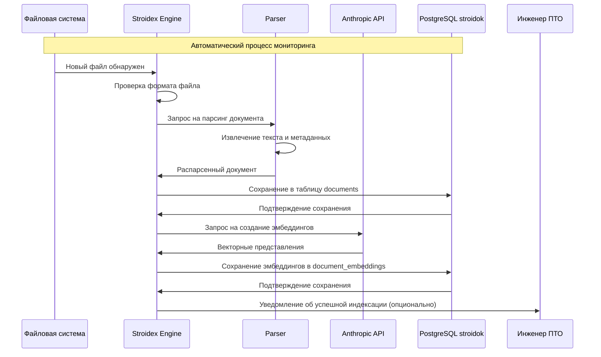
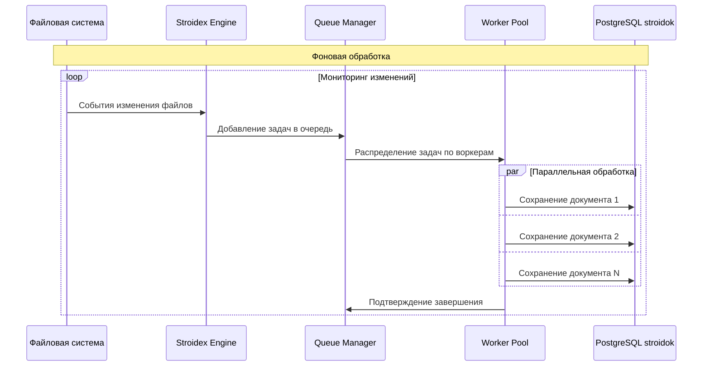
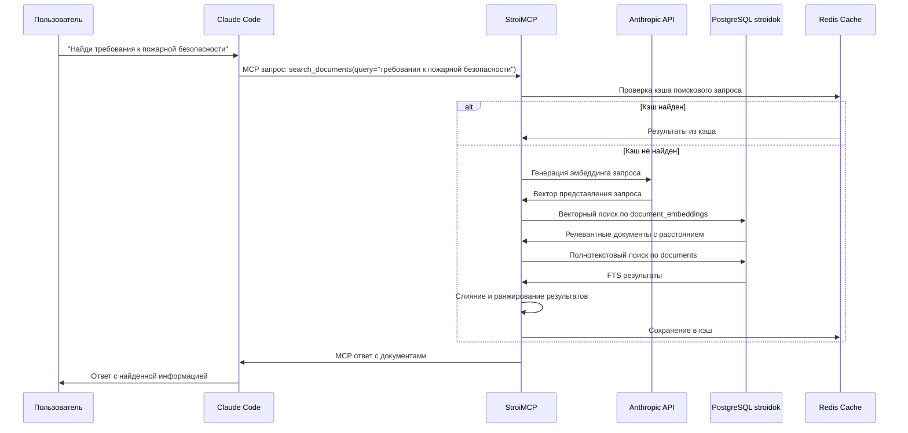
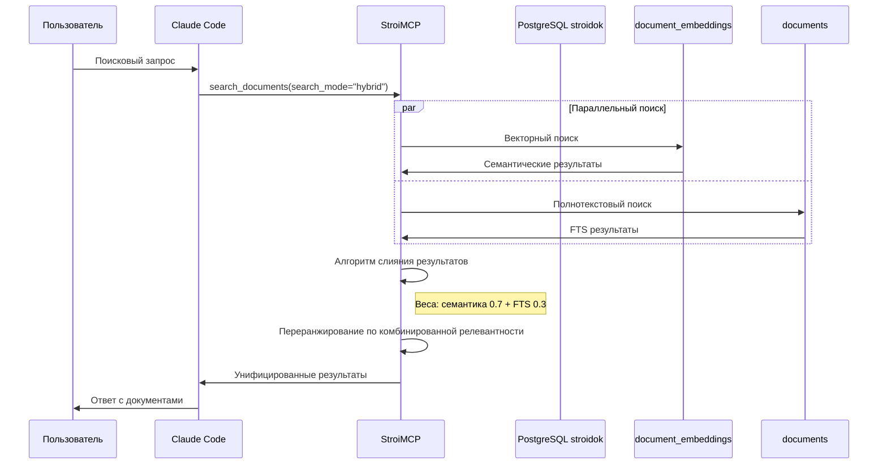
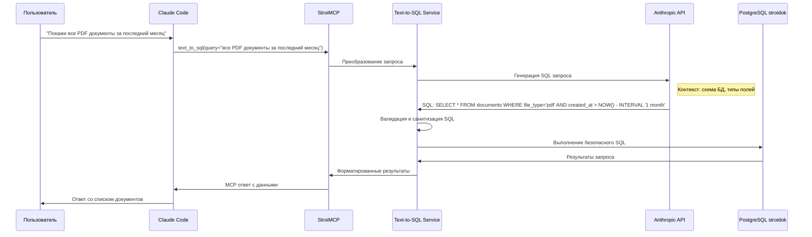
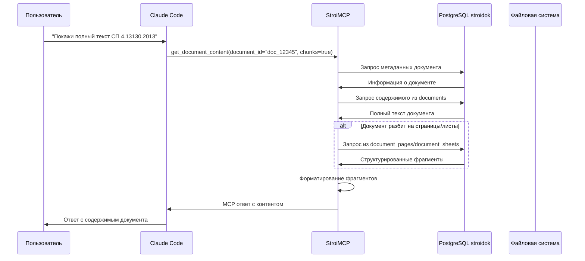
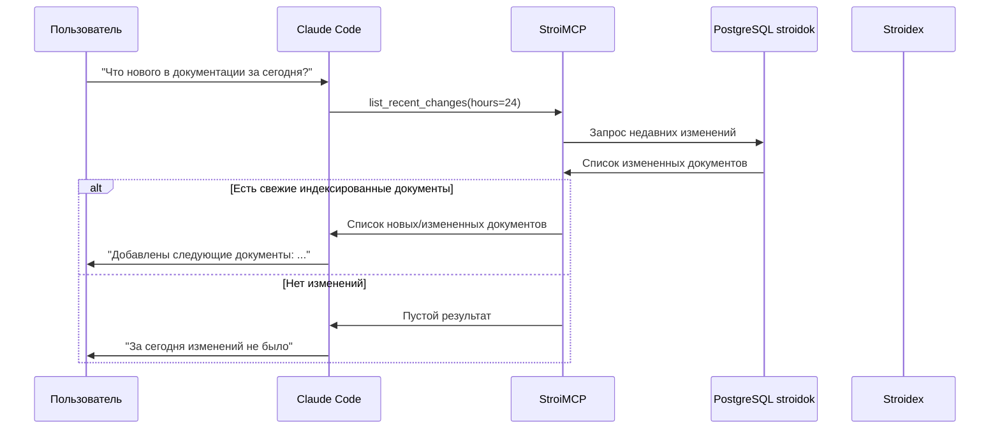
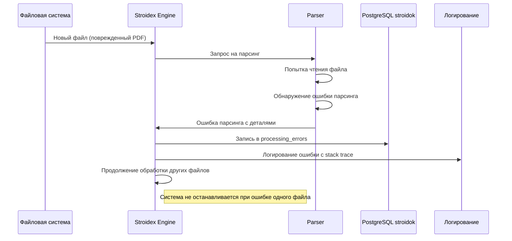
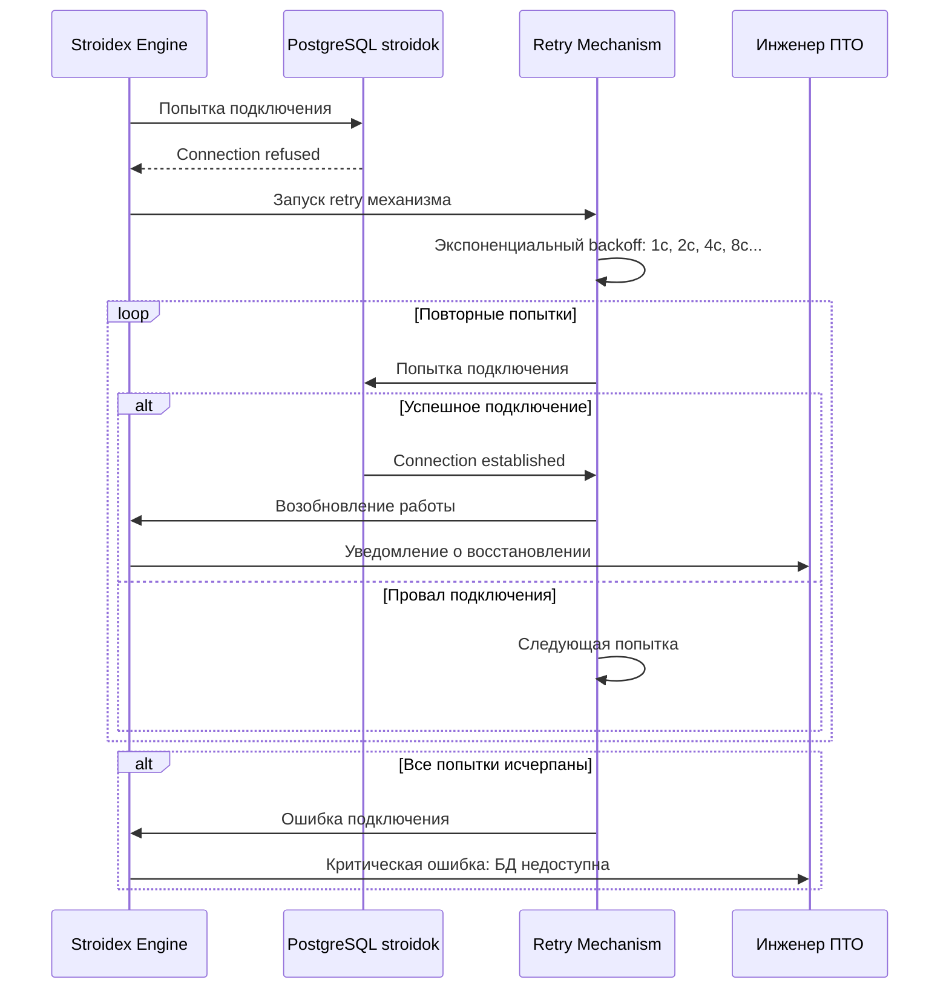
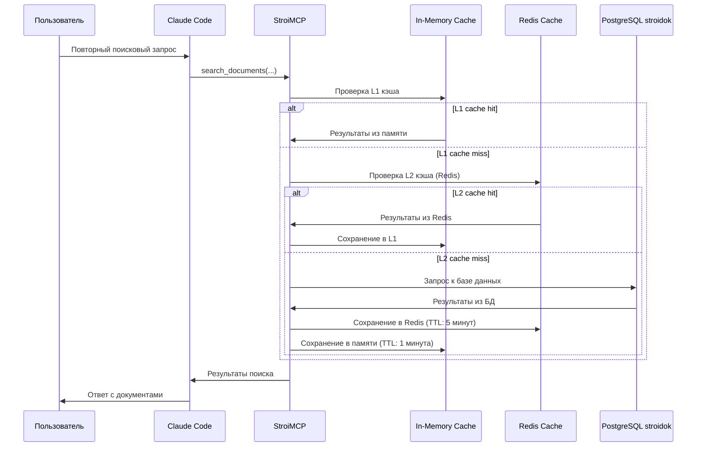

# Sequence диаграммы основных сценариев StroiDok

## Обзор

Документ содержит sequence диаграммы ключевых сценариев взаимодействия компонентов системы StroiDok.

> **Терминология:** Все используемые термины определены в [`глоссарии`](../glossary.md)

## Сценарий 1: Индексация нового документа

### 1.1 Обнаружение и индексация файла

### 1.2 Пакетная обработка изменений

## Сценарий 2: Семантический поиск через MCP

### 2.1 Поиск документов через Claude Code

### 2.2 Гибридный поиск (семантический + полнотекстовый)

## Сценарий 3: Text-to-SQL запросы

### 3.1 Запрос на естественном языке

## Сценарий 4: Получение содержимого документа

### 4.1 Полный документ и фрагменты

## Сценарий 5: Оповещение об изменениях

### 5.1 Мониторинг последних изменений

## Сценарий 6: Обработка ошибок

### 6.1 Ошибка парсинга документа

### 6.2 Недоступность базы данных

## Сценарий 7: Кэширование результатов

### 7.1 Многоуровневое кэширование

## Метрики производительности сценариев

| Сценарий | Целевое время | Максимальное время | Частота выполнения |
|----------|---------------|-------------------|-------------------|
| Индексация документа | < 5 секунд | 30 секунд | По мере поступления |
| Семантический поиск | < 1 секунда | 3 секунды | Высокая |
| Text-to-SQL запрос | < 2 секунды | 10 секунд | Средняя |
| Получение документа | < 500мс | 2 секунды | Средняя |
| Проверка изменений | < 200мс | 1 секунда | Периодическая |

## Примечания к диаграммам

1. **Асинхронность:** Многие операции выполняются асинхронно для повышения производительности
2. **Отказоустойчивость:** Все критические операции имеют механизмы retry и graceful degradation
3. **Кэширование:** Многоуровневое кэширование снижает нагрузку на базу данных
4. **Масштабируемость:** Использование worker pool для параллельной обработки
5. **Безопасность:** Валидация всех входных данных и SQL запросов