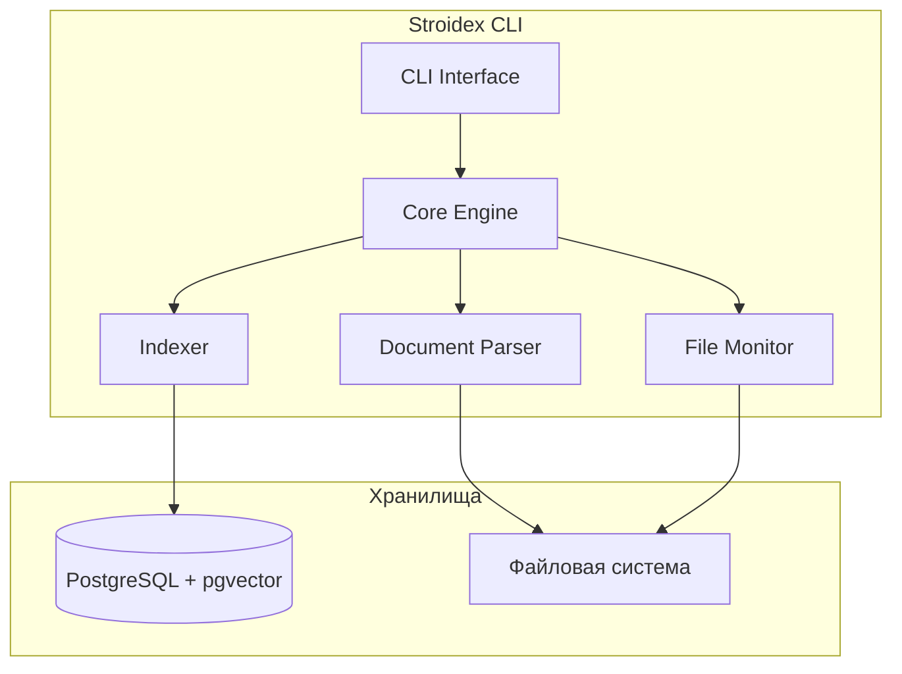
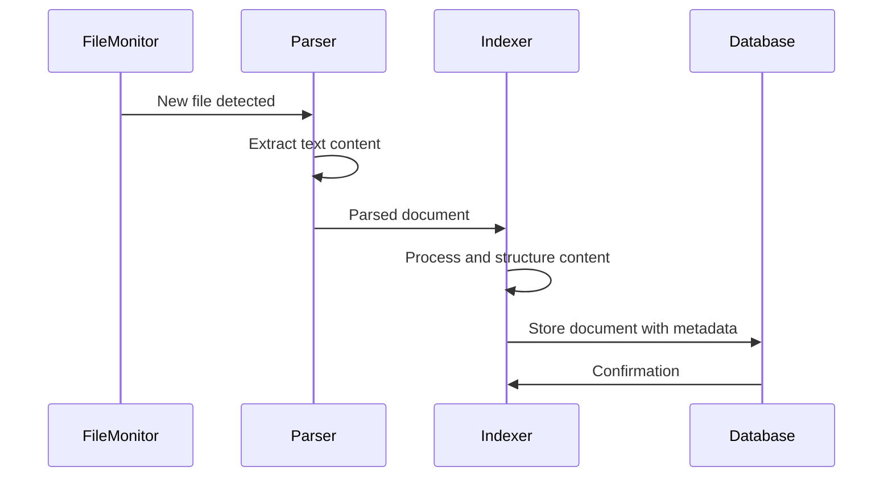
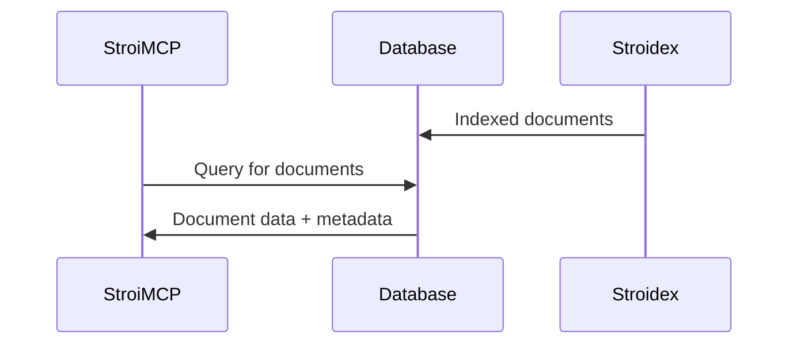

# Архитектура Stroidex CLI приложения

## Назначение

**Stroidex** - кроссплатформенное CLI приложение на Go для мониторинга и индексации строительной документации. Приложение автоматически отслеживает изменения в файловой системе, извлекает текстовое содержимое из документов различных форматов и загружает обработанные данные в базу данных для последующего использования другими компонентами системы (например, StroiMCP).

## C4 Level 2 - Контейнерная диаграмма



## Архитектурные слои

### 1. Presentation Layer (CLI Interface)
```go
// cmd/stroidex/root.go
type CLI struct {
   rootCmd *cobra.Command
   config  *Config
   service *CoreService
}
```
**Ответственности:**
- Парсинг аргументов командной строки
- Валидация параметров запуска
- Форматирование вывода
- Обработка интерактивного режима

**Основные компоненты:**
- **Cobra CLI** - фреймворк для консольного интерфейса
- **Viper** - управление конфигурацией
- **PromptUI** - интерактивные диалоги

### 2. Application Layer (Core Engine)
```go
// internal/core/engine.go
type CoreEngine struct {
   parser     DocumentParser
   indexer    Indexer
   monitor    FileMonitor
   repository DocumentRepository
}
```
**Ответственности:**
- Оркестрация процессов обработки документов
- Управление жизненным циклом компонентов
- Обработка бизнес-логики
- Координация асинхронных задач
- Мониторинг файловой системы
- Индексация документов в базу данных

### 3. Domain Layer
#### Document Parser
```go
// internal/parser/parser.go
type DocumentParser interface {
   ParseDocument(ctx context.Context, path string) (*Document, error)
   SupportedExtensions() []string
}
```

**Поддерживаемые форматы:**
- **PDF** - через `github.com/ledongthuc/pdf` (оптимизирован для чтения)
- **DOC/DOCX** - через `github.com/sajari/docx` (легковесный парсер)
- **XLSX** - через `github.com/tealeg/xlsx/v3` (стабильное чтение)
- **TXT** - нативная обработка

**Выбор библиотек для чтения документов:**

Так как приложение работает только в режиме чтения, выбраны легковесные специализированные библиотеки:

```go
// go.mod
require (
    github.com/ledongthuc/pdf v1.0.0    // PDF - минимальный размер и простой API
    github.com/sajari/docx v1.0.0       // DOCX - специализирован для чтения
    github.com/tealeg/xlsx/v3 v3.3.6   // XLSX - надежное чтение таблиц
)
```

**Преимущества выбранного стека:**
- ✅ Минимальный размер binary файла для CLI приложения
- ✅ Минимальные зависимости и быстрая компиляция
- ✅ Бесплатные без лицензионных ограничений
- ✅ Оптимизированы именно для чтения документов
- ✅ Простота интеграции и использования

#### Indexer
```go
// internal/indexer/indexer.go
type Indexer interface {
   IndexDocument(ctx context.Context, doc *Document) error
   SearchSimilar(ctx context.Context, query string, limit int) ([]*Document, error)
}
```

**Возможности:**
- Создание текстовых представлений документов
- Подготовка структурированных данных для хранения
- Извлечение метаданных документов
- Оптимизация для последующего поиска внешними компонентами

### 4. Infrastructure Layer
#### File Monitor
```go
// internal/monitor/monitor.go
type FileMonitor struct {
   watcher   *fsnotify.Watcher
   processor DocumentProcessor
   events    chan FileEvent
}
```

**Функциональность:**
- Отслеживание изменений в файловой системе
- Фильтрация по типам файлов
- Дебаунсинг событий
- Пакетная обработка изменений

#### Database Layer
```go
// internal/repository/postgres.go
type PostgresRepository struct {
   db     *sqlx.DB
   vector *pgvector.Vector
}
```

**Схема базы данных:**
Подробная схема базы данных описана в [`../database-schema.md`](../database-schema.md)

Stroidex использует следующие таблицы:
- `documents` - основная информация о документах (чтение/запись)
- `document_pages` - построчное содержимое PDF (чтение/запись)
- `document_sheets` - содержимое таблиц Excel (чтение/запись)
- `processing_errors` - логирование ошибок (чтение/запись)
- `document_embeddings` - только чтение эмбеддингов

## Взаимодействие компонентов

### Процесс индексации документа


### Взаимодействие с внешними компонентами


**Примечание:** Stroidex не обрабатывает пользовательские запросы напрямую - он только обеспечивает индексацию и хранение документов. Поиск и обработка запросов осуществляются внешними компонентами (например, StroiMCP).

## Конфигурация

### Структура конфигурации
```yaml
# config.yaml
database:
  host: localhost
  port: 5432
  name: stroidok
  user: stroidok
  password: ${DB_PASSWORD}

monitoring:
  directories:
    - /path/to/documents
    - /path/to/specs
  file_patterns:
    - "*.pdf"
    - "*.docx"
    - "*.xlsx"
    - "*.txt"

indexing:
  batch_size: 10
  watch_interval: 30s  # Интервал проверки изменений
  max_file_size: 100MB # Максимальный размер файла для обработки
```

## Обработка ошибок

### Стратегия обработки ошибок
- **File parsing errors** - логирование с продолжением обработки других файлов
- **Database errors** - retry механизм с экспоненциальным backoff
- **File system errors** - логирование и пропуск проблемных файлов
- **Network errors** - повторное подключение к базе данных

## Производительность

### Оптимизации
- **Параллельная обработка** - goroutine pool для обработки документов
- **Потоковая обработка** - для больших файлов
- **Пакетная индексация** - групповая обработка изменений
- **Дебаунсинг файловых событий** - избежание дублирования обработки

### Метрики производительности
- Время индексации одного документа: < 5 секунд
- Скорость мониторинга: реакция на изменения < 30 секунд
- Потребление памяти: < 256MB для 10K документов
- Пропускная способность: до 100 документов в минуту

## Безопасность

### Меры безопасности
- **Пароли БД** - хранение в переменных окружения
- **Доступ к файлам** - валидация путей и прав доступа
- **Ограничения** - максимальный размер обрабатываемых файлов
- **Логирование** - без записи чувствительных данных

## Интеграция с другими компонентами

### API для внешнего доступа
Stroidex предоставляет доступ к индексированным документам через:
- **PostgreSQL базу данных** - прямое подключение для чтения
- **REST API** (опционально) - для получения списка документов и содержимого
- **File Watcher** - уведомления об изменениях в документах

**Предполагаемый потребитель:** StroiMCP и другие компоненты системы для анализа документации