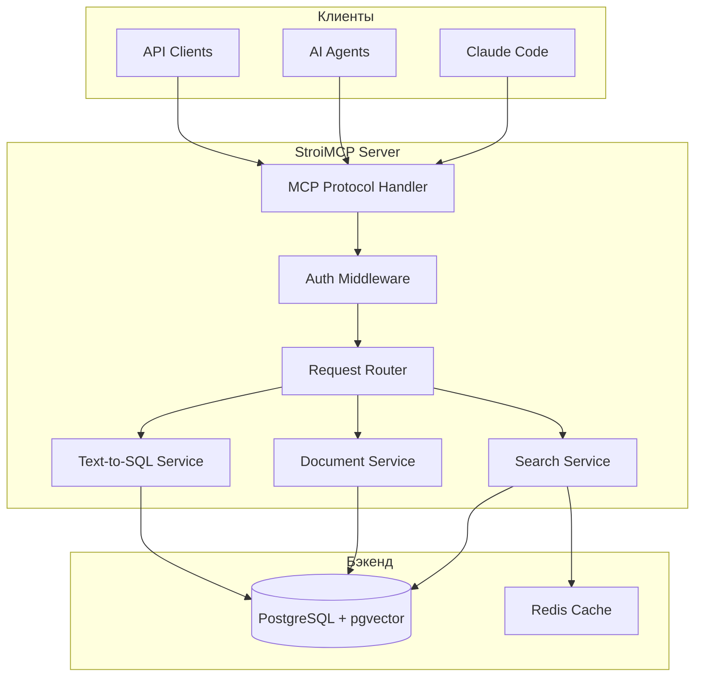
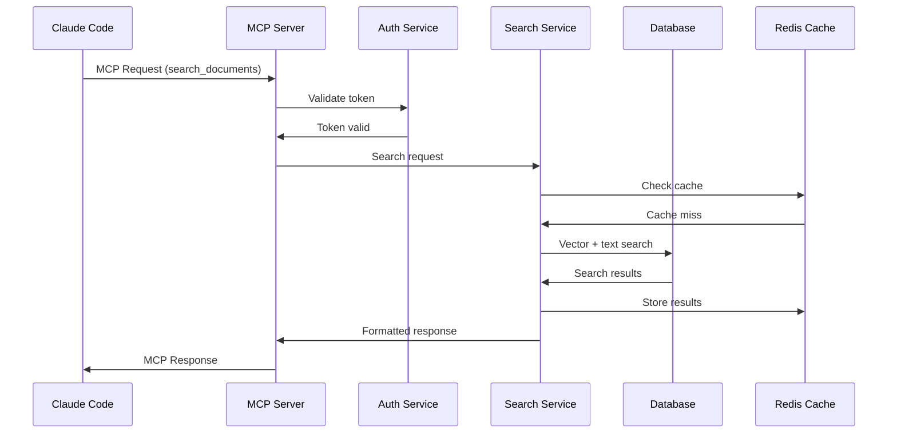

# Архитектура StroiMCP сервера

## Назначение

**StroiMCP** - MCP (Model Context Protocol) сервер для интеграции StroiDok с Claude Code и другими AI агентами. Предоставляет инструменты для поиска и анализа строительной документации в контексте диалога с AI.

## C4 Level 2 - Контейнерная диаграмма



## MCP протокол

### Поддерживаемые инструменты (Tools)

```go
// internal/mcp/tools.go
type ToolsRegistry struct {
   searchTool    *SearchDocumentsTool
   getDocTool    *GetDocumentTool
    listTool      *ListRecentChangesTool
    sqlTool       *TextToSQLTool
}
```

#### 1. search_documents
```json
{
  "name": "search_documents",
  "description": "Поиск релевантных документов по строительной тематике",
  "parameters": {
    "query": {
      "type": "string",
      "description": "Поисковый запрос на естественном языке"
    },
    "limit": {
      "type": "integer",
      "default": 5,
      "description": "Количество результатов"
    },
    "document_types": {
      "type": "array",
      "items": {"type": "string"},
      "description": "Фильтр по типам документов"
    }
  }
}
```

#### 2. get_document_content
```json
{
  "name": "get_document_content",
  "description": "Получение полного содержимого документа",
  "parameters": {
    "document_id": {
      "type": "string",
      "description": "ID документа"
    },
    "chunks": {
      "type": "boolean",
      "default": false,
      "description": "Вернуть документ по частям"
    }
  }
}
```

#### 3. list_recent_changes
```json
{
  "name": "list_recent_changes",
  "description": "Получение списка недавно измененных документов",
  "parameters": {
    "hours": {
      "type": "integer",
      "default": 24,
      "description": "Период в часах"
    },
    "limit": {
      "type": "integer",
      "default": 10,
      "description": "Количество результатов"
    }
  }
}
```

#### 4. text_to_sql
```json
{
  "name": "text_to_sql",
  "description": "Выполнение поисковых запросов на естественном языке",
  "parameters": {
    "query": {
      "type": "string",
      "description": "Запрос на естественном языке"
    },
    "filters": {
      "type": "object",
      "description": "Дополнительные фильтры"
    }
  }
}
```

## Архитектурные слои

### 1. Transport Layer (MCP Protocol)
```go
// internal/transport/mcp.go
type MCPServer struct {
   server   *mcp.Server
   registry *ToolsRegistry
   auth     *AuthService
}

type MCPRequest struct {
   Method string          `json:"method"`
   Params json.RawMessage `json:"params"`
   ID     interface{}     `json:"id"`
}
```

**Ответственности:**
- Обработка MCP протокола
- Валидация запросов
- Маршрутизация к инструментам
- Форматирование ответов

### 2. Service Layer
#### Search Service
```go
// internal/service/search.go
type SearchService struct {
   repo      DocumentRepository
   vector    VectorSearch
   cache     Cache
   llm       LLMClient
}

func (s *SearchService) Search(ctx context.Context, req *SearchRequest) (*SearchResponse, error) {
   // 1. Поиск по векторным представлениям
   vectorResults, err := s.vector.Search(ctx, req.Query, req.Limit)

   // 2. Полнотекстовый поиск
   textResults, err := s.repo.FullTextSearch(ctx, req.Query, req.Limit)

   // 3. Ранжирование и слияние результатов
   mergedResults := s.mergeResults(vectorResults, textResults)

   // 4. Кэширование результатов
   s.cache.Set(ctx, req.CacheKey(), mergedResults, 5*time.Minute)

   return &SearchResponse{Documents: mergedResults}, nil
}
```

#### Document Service
```go
// internal/service/document.go
type DocumentService struct {
   repo    DocumentRepository
   storage FileStorage
}

func (s *DocumentService) GetDocument(ctx context.Context, id string) (*Document, error) {
   doc, err := s.repo.GetByID(ctx, id)
   if err != nil {
      return nil, err
   }

   // Загрузка содержимого из хранилища
   content, err := s.storage.Get(ctx, doc.StoragePath)
   if err != nil {
      return nil, err
   }

   doc.Content = content
   return doc, nil
}
```

#### Text-to-SQL Service
```go
// internal/service/sql.go
type TextToSQLService struct {
   repo       DocumentRepository
   queryBuilder *NaturalLanguageToSQL
   llm        LLMClient
}

func (s *TextToSQLService) ExecuteQuery(ctx context.Context, query string, filters map[string]interface{}) (*QueryResult, error) {
   // 1. Преобразование естественного языка в SQL
   sqlQuery, err := s.queryBuilder.BuildSQL(query, filters)
   if err != nil {
      return nil, err
   }

   // 2. Выполнение SQL запроса
   results, err := s.repo.ExecuteSQL(ctx, sqlQuery)
   if err != nil {
      return nil, err
   }

   // 3. Форматирование результатов
   return s.formatResults(results), nil
}
```

### 3. Repository Layer
```go
// internal/repository/postgres.go
type PostgresRepository struct {
   db     *sqlx.DB
   vector *pgvector.Vector
}

func (r *PostgresRepository) VectorSearch(ctx context.Context, queryEmbedding []float32, limit int) ([]*Document, error) {
   query := `
       SELECT d.*, e.embedding <=> $1 as distance
       FROM documents d
       JOIN document_embeddings e ON d.id = e.document_id
       ORDER BY distance
       LIMIT $2
   `

   var results []DocumentResult
   err := r.db.SelectContext(ctx, &results, query, queryEmbedding, limit)
   if err != nil {
      return nil, err
   }

   return r.mapToDocuments(results), nil
}
```

**Схема базы данных:**
Подробная схема базы данных описана в [`../database-schema.md`](../database-schema.md)

StroiMCP использует следующие таблицы:
- `documents` - основная информация о документах (только чтение)
- `document_pages` - построчное содержимое PDF (только чтение)
- `document_sheets` - содержимое таблиц Excel (только чтение)
- `document_embeddings` - векторные представления (чтение/запись)

## Кэширование

### Стратегия кэширования
```go
// internal/cache/redis.go
type RedisCache struct {
   client *redis.Client
   ttl    time.Duration
}

func (c *RedisCache) SearchResults(ctx context.Context, query string) (*SearchResponse, error) {
   key := fmt.Sprintf("search:%s", utils.Hash(query))
   data, err := c.client.Get(ctx, key).Result()
   if err == redis.Nil {
      return nil, ErrNotFound
   }

   var result SearchResponse
   err = json.Unmarshal([]byte(data), &result)
   return &result, err
}
```

**Уровни кэширования:**
- **L1** - in-memory cache для горячих запросов
- **L2** - Redis для поиска и документов
- **L3** - PostgreSQL кэш запросов

## Аутентификация и авторизация

### JWT аутентификация
```go
// internal/auth/jwt.go
type JWTAuth struct {
   secretKey []byte
   issuer    string
}

func (a *JWTAuth) ValidateToken(tokenString string) (*Claims, error) {
   token, err := jwt.ParseWithClaims(tokenString, &Claims{}, func(token *jwt.Token) (interface{}, error) {
      return a.secretKey, nil
   })

   if claims, ok := token.Claims.(*Claims); ok && token.Valid {
      return claims, nil
   }

   return nil, ErrInvalidToken
}
```

### Права доступа
- **read** - доступ к поиску и чтению документов
- **write** - добавление и изменение документов
- **admin** - управление системой

## Обработка запросов

### Жизненный цикл запроса


## Метрики и мониторинг

### Ключевые метрики
- **Количество запросов** в секунду
- **Время ответа** по типам запросов
- **Hit rate кэша**
- **Количество активных сессий**
- **Ошибки по типам**

### Prometheus метрики
```go
// internal/metrics/prometheus.go
var (
    requestDuration = prometheus.NewHistogramVec(
        prometheus.HistogramOpts{
            Name: "mcp_request_duration_seconds",
            Help: "Duration of MCP requests",
        },
        []string{"method", "status"},
    )

    requestCount = prometheus.NewCounterVec(
        prometheus.CounterOpts{
            Name: "mcp_requests_total",
            Help: "Total number of MCP requests",
        },
        []string{"method", "status"},
    )
)
```

## Конфигурация

### Конфигурация сервера
```yaml
# config/mcp.yaml
server:
  host: 0.0.0.0
  port: 8080
  read_timeout: 30s
  write_timeout: 30s

auth:
  jwt_secret: ${JWT_SECRET}
  token_expiry: 24h

database:
  host: localhost
  port: 5432
  name: stroidok
  user: stroimcp
  password: ${DB_PASSWORD}
  max_connections: 20

cache:
  redis:
    host: localhost
    port: 6379
    db: 0
    ttl: 5m

logging:
  level: info
  format: json
```

## Развертывание

### Docker контейнер
```dockerfile
FROM golang:1.21-alpine AS builder

WORKDIR /app
COPY go.mod go.sum ./
RUN go mod download

COPY . .
RUN go build -o stroimcp cmd/mcp/main.go

FROM alpine:latest
RUN apk --no-cache add ca-certificates
WORKDIR /root/

COPY --from=builder /app/stroimcp .
COPY --from=builder /app/config ./config

CMD ["./stroimcp"]
```

### Kubernetes deployment
```yaml
apiVersion: apps/v1
kind: Deployment
metadata:
  name: stroimcp
spec:
  replicas: 3
  selector:
    matchLabels:
      app: stroimcp
  template:
    metadata:
      labels:
        app: stroimcp
    spec:
      containers:
      - name: stroimcp
        image: stroimcp:latest
        ports:
        - containerPort: 8080
        env:
        - name: DB_PASSWORD
          valueFrom:
            secretKeyRef:
              name: stroidok-secrets
              key: db-password
```