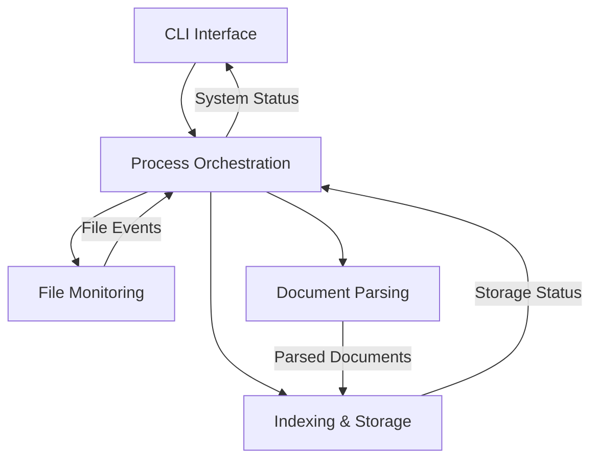

# Спецификации Stroidex

## Обзор

В этом каталоге находятся детальные технические спецификации для каждой функции приложения Stroidex.

## Структура спецификаций

### 📁 [Мониторинг файловой системы](./file-monitoring.md)
- Отслеживание изменений в директориях
- Фильтрация файлов по расширениям
- Дебаунсинг событий
- Обработка ошибок файловой системы

### 📄 [Парсинг документов](./document-parsing.md)
- Извлечение текста из PDF, DOCX, XLSX, TXT
- Обработка метаданных
- Валидация контента
- Обработка поврежденных файлов

### 🗄️ [Индексация и хранение](./indexing-storage.md)
- Сохранение документов в PostgreSQL
- Создание поисковых индексов
- Управление версиями документов
- Оптимизация запросов

### ⚙️ [Оркестрация процессов](./process-orchestration.md)
- Координация компонентов
- Параллельная обработка
- Управление очередями задач
- Обработка ошибок и retry механизмы

### 💻 [CLI интерфейс](./cli-interface.md)
- Команды управления системой
- Форматирование вывода
- Интерактивные диалоги
- Обработка пользовательского ввода

## Общие принципы

### ID требований
Каждое требование имеет уникальный идентификатор:
- **FM** - File Monitoring
- **DP** - Document Parsing
- **IS** - Indexing & Storage
- **PO** - Process Orchestration
- **CLI** - CLI Interface

### Структура спецификации
Каждая спецификация содержит:
- **Обзор** - назначение функции
- **Требования** - функциональные и нефункциональные
- **Архитектура** - компоненты и интерфейсы
- **API** - методы и конфигурация
- **Алгоритмы** - детали реализации
- **Тестирование** - стратегии тестирования
- **Метрики** - ключевые показатели

## Связи между спецификациями

## Приоритеты реализации

### Phase 1 (Critical)
1. **Document Parsing** - основная функциональность
2. **Indexing & Storage** - сохранение результатов
3. **Process Orchestration** - координация процессов

### Phase 2 (Important)
4. **CLI Interface** - пользовательское взаимодействие
5. **File Monitoring** - автоматизация

## Технический стек

### Основные зависимости
- **Go 1.21+** - основной язык разработки
- **PostgreSQL** - хранение данных
- **fsnotify** - мониторинг файловой системы
- **ledongthuc/pdf** - парсинг PDF
- **sajari/docx** - парсинг DOCX
- **tealeg/xlsx** - парсинг XLSX

### Инструменты
- **Cobra** - CLI фреймворк
- **Viper** - управление конфигурацией
- **Zap** - структурированное логирование
- **Prometheus** - метрики и мониторинг
- **Testify** - фреймворк для тестирования

## Качество кода

### Стандарты
- Go fmt + goimports
- golint + go vet
- Тестовое покрытие > 80%
- Documentation для всех public API

### Метрики качества
- Cyclomatic complexity < 10
- Дублирование кода < 5%
- Технический долг < 1 день на модуль

## Версионирование

Спецификации следуют семантическому версионированию:
- **Major** - изменение архитектуры
- **Minor** - добавление функциональности
- **Patch** - исправление ошибок

## Валидация

Перед реализацией каждая спецификация должна быть:
- ✅ Проверена на полноту
- ✅ Согласована с архитектурой
- ✅ Покрыта тестами
- ✅ Валидирована на производительность