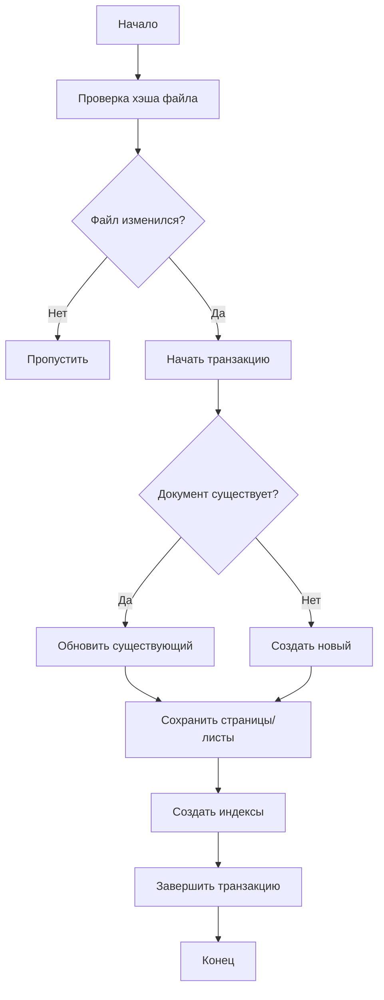

# Спецификация: Индексация и хранение документов

## Обзор

Функция индексации и хранения отвечает за сохранение обработанных документов в базе данных PostgreSQL, создание индексов для поиска и обеспечение целостности данных.

## Требования

### Функциональные требования

#### 1. Хранение документов
- **ID:** IS-001
- **Описание:** Система должна сохранять:
  - Текстовое содержимое документов
  - Метаданные файлов
  - Структурированные данные (страницы, листы)
  - Информацию об обработке

#### 2. Индексация для поиска
- **ID:** IS-002
- **Описание:** Система должна создавать:
  - Полнотекстовый индекс для русского языка
  - Индексы по метаданным
  - Индексы по времени изменения
  - Индексы по типу файла

#### 3. Управление версиями
- **ID:** IS-003
- **Описание:** Система должна отслеживать:
  - Изменения документов
  - Удаление документов
  - Историю обработки

#### 4. Обработка дубликатов
- **ID:** IS-004
- **Описание:** Система должна:
  - Определять дубликаты по пути к файлу
  - Обновлять существующие записи
  - Сохранять историю изменений

### Нефункциональные требования

#### Производительность
- Время индексации документа: < 1 секунда
- Поддержка до 1 000 000 документов
- Время поиска по индексу: < 100ms

#### Надежность
- ACID транзакции для сохранения целостности
- Резервное копирование данных
- Восстановление после сбоев

## Архитектура

### Схема базы данных

```sql
-- Основная таблица документов
CREATE TABLE documents (
    id SERIAL PRIMARY KEY,
    file_path TEXT UNIQUE NOT NULL,
    file_name TEXT NOT NULL,
    file_type TEXT NOT NULL,
    file_size BIGINT NOT NULL,
    content TEXT,
    metadata JSONB,
    processed_at TIMESTAMP DEFAULT NOW(),
    created_at TIMESTAMP NOT NULL,
    modified_at TIMESTAMP NOT NULL,
    file_hash TEXT UNIQUE,
    status TEXT DEFAULT 'processed' -- processed, error, pending
);

-- Таблица страниц (для PDF)
CREATE TABLE document_pages (
    id SERIAL PRIMARY KEY,
    document_id INTEGER REFERENCES documents(id) ON DELETE CASCADE,
    page_number INTEGER NOT NULL,
    page_content TEXT,
    page_metadata JSONB
);

-- Таблица листов (для XLSX)
CREATE TABLE document_sheets (
    id SERIAL PRIMARY KEY,
    document_id INTEGER REFERENCES documents(id) ON DELETE CASCADE,
    sheet_name TEXT NOT NULL,
    sheet_content JSONB,
    row_count INTEGER,
    column_count INTEGER
);

-- Таблица эмбеддингов для векторного поиска
CREATE TABLE document_embeddings (
    id SERIAL PRIMARY KEY,
    document_id INTEGER REFERENCES documents(id) ON DELETE CASCADE,
    embedding vector(1536), -- Размерность зависит от модели
    model_name TEXT NOT NULL, -- Название модели (text-embedding-ada-002 и т.д.)
    created_at TIMESTAMP DEFAULT NOW(),
    updated_at TIMESTAMP DEFAULT NOW()
);

-- Таблица ошибок обработки
CREATE TABLE processing_errors (
    id SERIAL PRIMARY KEY,
    file_path TEXT NOT NULL,
    error_type TEXT NOT NULL,
    error_message TEXT,
    stack_trace TEXT,
    occurred_at TIMESTAMP DEFAULT NOW()
);

-- Полнотекстовый индекс
CREATE INDEX documents_content_fts ON documents
USING gin(to_tsvector('russian', content));

-- Индексы по метаданным
CREATE INDEX documents_file_path_idx ON documents(file_path);
CREATE INDEX documents_file_type_idx ON documents(file_type);
CREATE INDEX documents_modified_at_idx ON documents(modified_at);
CREATE INDEX documents_status_idx ON documents(status);
CREATE INDEX documents_file_hash_idx ON documents(file_hash);

-- Индекс по JSONB метаданным
CREATE INDEX documents_metadata_idx ON documents USING gin(metadata);

-- Векторный индекс для семантического поиска
CREATE INDEX document_embeddings_vector_idx ON document_embeddings
USING ivfflat (embedding vector_cosine_ops) WITH (lists = 100);

-- Индекс по document_id для быстрых JOIN
CREATE INDEX document_embeddings_document_id_idx ON document_embeddings(document_id);
```

### Интерфейс индексатора

```go
type Indexer interface {
    IndexDocument(ctx context.Context, doc *Document) error
    UpdateDocument(ctx context.Context, doc *Document) error
    DeleteDocument(ctx context.Context, path string) error
    GetDocument(ctx context.Context, path string) (*Document, error)
    SearchDocuments(ctx context.Context, query *SearchQuery) ([]*Document, error)
    GetStatus(ctx context.Context) (*IndexerStatus, error)

    // Методы для работы с эмбеддингами (для StroiMCP)
    SaveEmbedding(ctx context.Context, documentID int, embedding []float32, modelName string) error
    GetEmbedding(ctx context.Context, documentID int, modelName string) ([]float32, error)
    VectorSearch(ctx context.Context, queryEmbedding []float32, limit int) ([]*Document, error)
}

type SearchQuery struct {
    Text        string                 `json:"text"`
    FileType    string                 `json:"file_type,omitempty"`
    Metadata    map[string]interface{} `json:"metadata,omitempty"`
    DateFrom    time.Time              `json:"date_from,omitempty"`
    DateTo      time.Time              `json:"date_to,omitempty"`
    Limit       int                    `json:"limit,omitempty"`
    Offset      int                    `json:"offset,omitempty"`
}

type IndexerStatus struct {
    TotalDocuments   int64     `json:"total_documents"`
    ProcessedDocs    int64     `json:"processed_docs"`
    ErrorDocs        int64     `json:"error_docs"`
    LastIndexed      time.Time `json:"last_indexed"`
    IndexingSpeed    float64   `json:"indexing_speed"`
}
```

### Реализация индексатора

```go
type PostgresIndexer struct {
    db        *sqlx.DB
    batchSize int
    logger    *zap.Logger
}

func (i *PostgresIndexer) IndexDocument(ctx context.Context, doc *Document) error {
    tx, err := i.db.BeginTxx(ctx, nil)
    if err != nil {
        return fmt.Errorf("failed to begin transaction: %w", err)
    }
    defer tx.Rollback()

    // 1. Проверка на дубликат
    existing, err := i.getDocumentByPath(ctx, tx, doc.Path)
    if err != nil && !errors.Is(err, ErrDocumentNotFound) {
        return err
    }

    if existing != nil {
        // Обновление существующего документа
        err = i.updateExistingDocument(ctx, tx, existing, doc)
    } else {
        // Создание нового документа
        err = i.insertNewDocument(ctx, tx, doc)
    }

    if err != nil {
        return err
    }

    return tx.Commit()
}
```

## API

### Конфигурация

```yaml
database:
  host: localhost
  port: 5432
  name: stroidok
  user: stroidok
  password: ${DB_PASSWORD}
  ssl_mode: require
  max_connections: 20

indexing:
  batch_size: 100
  retry_attempts: 3
  retry_delay: 1s
  full_reindex_interval: 24h
  cleanup_interval: 1h
```

### Методы

```go
// Индексация документа
func (i *PostgresIndexer) IndexDocument(ctx context.Context, doc *Document) error

// Обновление документа
func (i *PostgresIndexer) UpdateDocument(ctx context.Context, doc *Document) error

// Удаление документа
func (i *PostgresIndexer) DeleteDocument(ctx context.Context, path string) error

// Поиск документов
func (i *PostgresIndexer) SearchDocuments(ctx context.Context, query *SearchQuery) ([]*Document, error)

// Получение статуса индексации
func (i *PostgresIndexer) GetStatus(ctx context.Context) (*IndexerStatus, error)

// Полная реиндексация
func (i *PostgresIndexer) FullReindex(ctx context.Context) error

// Очистка старых данных
func (i *PostgresIndexer) Cleanup(ctx context.Context, olderThan time.Duration) error
```

## Алгоритмы

### Индексация документа



### Поиск документов

```sql
-- Полнотекстовый поиск
SELECT d.id, d.file_name, d.content, d.metadata
FROM documents d
WHERE to_tsvector('russian', d.content) @@ to_tsquery('russian', :query)
  AND d.status = 'processed'
ORDER BY ts_rank(to_tsvector('russian', d.content), to_tsquery('russian', :query)) DESC
LIMIT :limit;

-- Поиск по метаданным
SELECT d.id, d.file_name, d.content
FROM documents d
WHERE d.metadata @> :metadata_filter
  AND d.file_type = :file_type;

-- Комплексный поиск
SELECT d.id, d.file_name, d.content
FROM documents d
WHERE (
    to_tsvector('russian', d.content) @@ to_tsquery('russian', :text_query) OR
    d.file_name ILIKE '%' || :text_query || '%'
)
  AND d.modified_at BETWEEN :date_from AND :date_to
  AND d.status = 'processed';

-- Векторный поиск (семантический)
SELECT d.id, d.file_name, d.content,
       e.embedding <=> :query_embedding as distance
FROM documents d
JOIN document_embeddings e ON d.id = e.document_id
WHERE d.status = 'processed'
  AND e.model_name = :model_name
ORDER BY e.embedding <=> :query_embedding
LIMIT :limit;

-- Гибридный поиск (полнотекстовый + векторный)
WITH fts_results AS (
    SELECT d.id,
           ts_rank(to_tsvector('russian', d.content), to_tsquery('russian', :text_query)) as ts_rank
    FROM documents d
    WHERE to_tsvector('russian', d.content) @@ to_tsquery('russian', :text_query)
      AND d.status = 'processed'
),
vector_results AS (
    SELECT d.id,
           (1 - (e.embedding <=> :query_embedding)) as vector_score
    FROM documents d
    JOIN document_embeddings e ON d.id = e.document_id
    WHERE d.status = 'processed'
      AND e.model_name = :model_name
    ORDER BY e.embedding <=> :query_embedding
    LIMIT 20
)
SELECT d.id, d.file_name, d.content,
       COALESCE(fr.ts_rank, 0) * 0.3 + COALESCE(vr.vector_score, 0) * 0.7 as combined_score
FROM documents d
LEFT JOIN fts_results fr ON d.id = fr.id
LEFT JOIN vector_results vr ON d.id = vr.id
WHERE fr.id IS NOT NULL OR vr.id IS NOT NULL
ORDER BY combined_score DESC
LIMIT :limit;
```

## Тестирование

### Unit тесты
- Тестирование CRUD операций
- Тестирование поиска
- Тестирование транзакций
- Тестирование обработки ошибок

### Integration тесты
- Тестирование с реальной базой данных
- Тестирование производительности
- Тестирование конкурентного доступа

### Тестовые сценарии
- Индексация 1000 документов
- Поиск в базе из 100000 документов
- Обновление существующих документов
- Обработка ошибок базы данных

## Метрики

### Ключевые показатели
- Скорость индексации (документов/секунду)
- Размер базы данных
- Время выполнения поисковых запросов
- Количество ошибок индексации

### Мониторинг

```go
type IndexerMetrics struct {
    DocumentsIndexed    prometheus.Counter
    DocumentsUpdated    prometheus.Counter
    DocumentsDeleted    prometheus.Counter
    IndexingDuration    prometheus.Histogram
    SearchDuration      prometheus.Histogram
    DatabaseConnections prometheus.Gauge
}
```

## Зависимости

- `github.com/lib/pq` - PostgreSQL драйвер
- `github.com/jmoiron/sqlx` - SQL расширения
- `github.com/pgvector/pgvector` - векторные расширения
- `github.com/prometheus/client_golang` - метрики
- `github.com/spf13/viper` - конфигурация