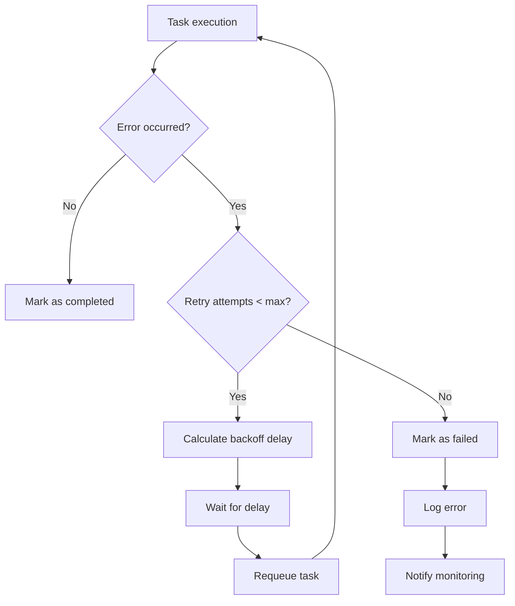

# Спецификация: Оркестрация процессов

## Обзор

Функция оркестрации отвечает за координацию всех компонентов системы, управление жизненным циклом обработки документов и обеспечение надежной работы приложения.

## Требования

### Функциональные требования

#### 1. Управление pipeline обработки
- **ID:** PO-001
- **Описание:** Система должна координировать:
  - Обнаружение файлов через File Monitor
  - Парсинг документов через Document Parser
  - Индексацию через Indexer
  - Обработку ошибок и retry механизмы

#### 2. Параллельная обработка
- **ID:** PO-002
- **Описание:** Система должна поддерживать:
  - Обработку до 10 документов одновременно
  - Queue для управления задачами
  - Приоритизацию задач
  - Ограничение ресурсов

#### 3. Обработка ошибок
- **ID:** PO-003
- **Описание:** Система должна:
  - Перезапускать упавшие задачи
  - Логировать ошибки с детализацией
  - Изолировать ошибки одного файла от других
  - Implement exponential backoff

#### 4. Управление состоянием
- **ID:** PO-004
- **Описание:** Система должна отслеживать:
  - Статус обработки каждого файла
  - Общую статистику системы
  - Состояние компонентов
  - Прогресс индексации

### Нефункциональные требования

#### Производительность
- Пропускная способность: до 100 документов/минуту
- Время реакции на событие: < 30 секунд
- Использование CPU: < 50%
- Использование памяти: < 256MB

#### Надежность
- Graceful shutdown
- Автоматическое восстановление после сбоев
- Сохранение состояния между перезапусками
- Health checks для компонентов

## Архитектура

### Основной оркестратор

```go
type CoreEngine struct {
    monitor     FileMonitor
    parser      DocumentParser
    indexer     Indexer
    queue       TaskQueue
    workers     *WorkerPool
    config      *EngineConfig
    state       *EngineState
    logger      *zap.Logger
    metrics     *EngineMetrics
}

type Task struct {
    ID          string        `json:"id"`
    Type        TaskType      `json:"type"`
    FilePath    string        `json:"file_path"`
    Priority    int           `json:"priority"`
    Status      TaskStatus    `json:"status"`
    CreatedAt   time.Time     `json:"created_at"`
    StartedAt   *time.Time    `json:"started_at,omitempty"`
    CompletedAt *time.Time    `json:"completed_at,omitempty"`
    Error       string        `json:"error,omitempty"`
    RetryCount  int           `json:"retry_count"`
}

type TaskType string
const (
    TaskTypeParse  TaskType = "parse"
    TaskTypeIndex  TaskType = "index"
    TaskTypeUpdate TaskType = "update"
    TaskTypeDelete TaskType = "delete"
)

type TaskStatus string
const (
    TaskStatusPending   TaskStatus = "pending"
    TaskStatusRunning   TaskStatus = "running"
    TaskStatusCompleted TaskStatus = "completed"
    TaskStatusFailed    TaskStatus = "failed"
    TaskStatusRetry     TaskStatus = "retry"
)
```

### Очередь задач

```go
type TaskQueue interface {
    Enqueue(task *Task) error
    Dequeue() (*Task, error)
    Requeue(task *Task) error
    GetStats() *QueueStats
    Close() error
}

type PriorityQueue struct {
    tasks    []*Task
    mutex    sync.RWMutex
    notEmpty chan struct{}
    maxSize  int
}

func (pq *PriorityQueue) Enqueue(task *Task) error {
    pq.mutex.Lock()
    defer pq.mutex.Unlock()

    if len(pq.tasks) >= pq.maxSize {
        return ErrQueueFull
    }

    heap.Push(pq, task)
    select {
    case pq.notEmpty <- struct{}{}:
    default:
    }

    return nil
}
```

### Пул воркеров

```go
type WorkerPool struct {
    workers   []*Worker
    taskQueue TaskQueue
    stopChan  chan struct{}
    wg        sync.WaitGroup
    config    *WorkerConfig
}

type Worker struct {
    id        int
    engine    *CoreEngine
    taskQueue TaskQueue
    stopChan  chan struct{}
}

func (w *Worker) Start() {
    w.wg.Add(1)
    go func() {
        defer w.wg.Done()
        for {
            select {
            case <-w.stopChan:
                return
            default:
                task, err := w.taskQueue.Dequeue()
                if err != nil {
                    if errors.Is(err, ErrQueueEmpty) {
                        time.Sleep(100 * time.Millisecond)
                        continue
                    }
                    w.logger.Error("Failed to dequeue task", "error", err)
                    continue
                }
                w.processTask(task)
            }
        }
    }()
}

func (w *Worker) processTask(task *Task) {
    task.Status = TaskStatusRunning
    task.StartedAt = now()

    var err error
    switch task.Type {
    case TaskTypeParse:
        err = w.engine.processParseTask(task)
    case TaskTypeIndex:
        err = w.engine.processIndexTask(task)
    case TaskTypeUpdate:
        err = w.engine.processUpdateTask(task)
    case TaskTypeDelete:
        err = w.engine.processDeleteTask(task)
    }

    if err != nil {
        w.handleTaskError(task, err)
    } else {
        w.handleTaskSuccess(task)
    }
}
```

### Управление состоянием

```go
type EngineState struct {
    Status       EngineStatus      `json:"status"`
    StartTime    time.Time         `json:"start_time"`
    TasksTotal   int64             `json:"tasks_total"`
    TasksDone    int64             `json:"tasks_done"`
    TasksFailed  int64             `json:"tasks_failed"`
    WorkersBusy  int               `json:"workers_busy"`
    QueueSize    int               `json:"queue_size"`
    LastActivity time.Time         `json:"last_activity"`
}

type EngineStatus string
const (
    StatusStarting   EngineStatus = "starting"
    StatusRunning    EngineStatus = "running"
    StatusStopping   EngineStatus = "stopping"
    StatusStopped    EngineStatus = "stopped"
    StatusError      EngineStatus = "error"
)
```

## API

### Конфигурация

```yaml
engine:
  workers:
    count: 10
    timeout: 5m
  queue:
    max_size: 1000
    priority_levels: 3
  retry:
    max_attempts: 3
    initial_delay: 1s
    max_delay: 30s
    backoff_factor: 2.0
  limits:
    max_file_size: 100MB
    max_concurrent_files: 50
  health_check:
    interval: 30s
    timeout: 5s
```

### Основные методы

```go
// Запуск оркестратора
func (e *CoreEngine) Start(ctx context.Context) error

// Остановка с graceful shutdown
func (e *CoreEngine) Stop(ctx context.Context) error

// Добавление задачи на обработку файла
func (e *CoreEngine) ProcessFile(ctx context.Context, filePath string) error

// Получение статуса системы
func (e *CoreEngine) GetStatus() *EngineStatus

// Получение статистики
func (e *CoreEngine) GetStats() *EngineStats

// Проверка здоровья системы
func (e *CoreEngine) HealthCheck() error
```

### Pipeline обработки

```go
func (e *CoreEngine) processFile(ctx context.Context, filePath string) error {
    // 1. Валидация файла
    if err := e.validateFile(filePath); err != nil {
        return fmt.Errorf("file validation failed: %w", err)
    }

    // 2. Создание задачи на парсинг
    parseTask := &Task{
        ID:       generateTaskID(),
        Type:     TaskTypeParse,
        FilePath: filePath,
        Priority: e.calculatePriority(filePath),
    }

    // 3. Отправка в очередь
    if err := e.queue.Enqueue(parseTask); err != nil {
        return fmt.Errorf("failed to enqueue parse task: %w", err)
    }

    return nil
}

func (e *CoreEngine) processParseTask(task *Task) error {
    // 1. Парсинг документа
    doc, err := e.parser.ParseDocument(ctx, task.FilePath)
    if err != nil {
        return fmt.Errorf("parse failed: %w", err)
    }

    // 2. Создание задачи на индексацию
    indexTask := &Task{
        ID:       generateTaskID(),
        Type:     TaskTypeIndex,
        FilePath: task.FilePath,
        Priority: task.Priority,
        Context:  map[string]interface{}{"document": doc},
    }

    return e.queue.Enqueue(indexTask)
}
```

## Алгоритмы

### Обработка ошибок



### Graceful Shutdown

```go
func (e *CoreEngine) Stop(ctx context.Context) error {
    e.state.Status = StatusStopping

    // 1. Остановка приема новых задач
    close(e.stopChan)

    // 2. Ожидание завершения текущих задач
    done := make(chan struct{})
    go func() {
        e.wg.Wait()
        close(done)
    }()

    select {
    case <-done:
        e.logger.Info("All workers stopped gracefully")
    case <-ctx.Done():
        e.logger.Warn("Shutdown timeout reached, forcing stop")
    }

    // 3. Остановка компонентов
    if err := e.monitor.Stop(); err != nil {
        e.logger.Error("Failed to stop monitor", "error", err)
    }

    e.state.Status = StatusStopped
    return nil
}
```

## Тестирование

### Unit тесты
- Тестирование очереди приоритетов
- Тестирование пула воркеров
- Тестирование retry механизма
- Тестирование graceful shutdown

### Integration тесты
- Тестирование полного pipeline
- Тестирование под нагрузкой
- Тестирование восстановления после сбоев

### Load тестирование
- Обработка 1000 файлов
- Параллельная обработка
- Пиковая нагрузка

## Метрики

### Ключевые показатели
- Пропускная способность (tasks/second)
- Время обработки задачи
- Количество ошибок
- Утилизация воркеров
- Размер очереди

### Prometheus метрики

```go
var (
    tasksProcessed = prometheus.NewCounterVec(
        prometheus.CounterOpts{
            Name: "stroidex_tasks_processed_total",
            Help: "Total number of tasks processed",
        },
        []string{"type", "status"},
    )

    taskDuration = prometheus.NewHistogramVec(
        prometheus.HistogramOpts{
            Name: "stroidex_task_duration_seconds",
            Help: "Duration of task processing",
        },
        []string{"type"},
    )

    queueSize = prometheus.NewGauge(
        prometheus.GaugeOpts{
            Name: "stroidex_queue_size",
            Help: "Current queue size",
        },
    )
)
```

## Зависимости

- `github.com/prometheus/client_golang` - метрики
- `go.uber.org/zap` - логирование
- `github.com/spf13/viper` - конфигурация
- `github.com/cenkalti/backoff` - exponential backoff
- `go.uber.org/atomic` - атомарные операции